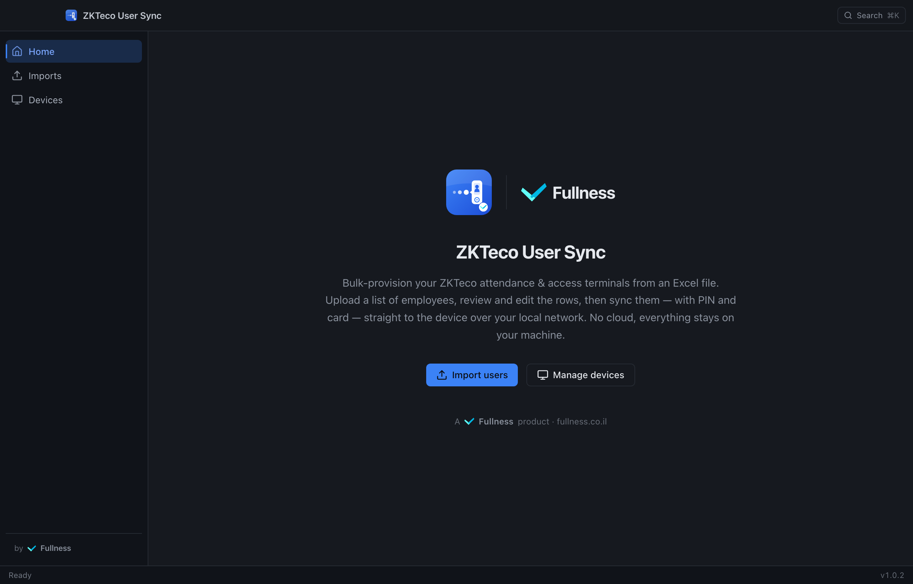
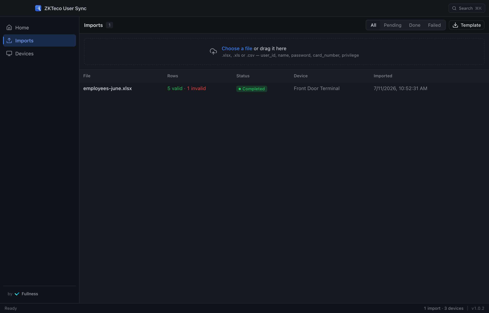
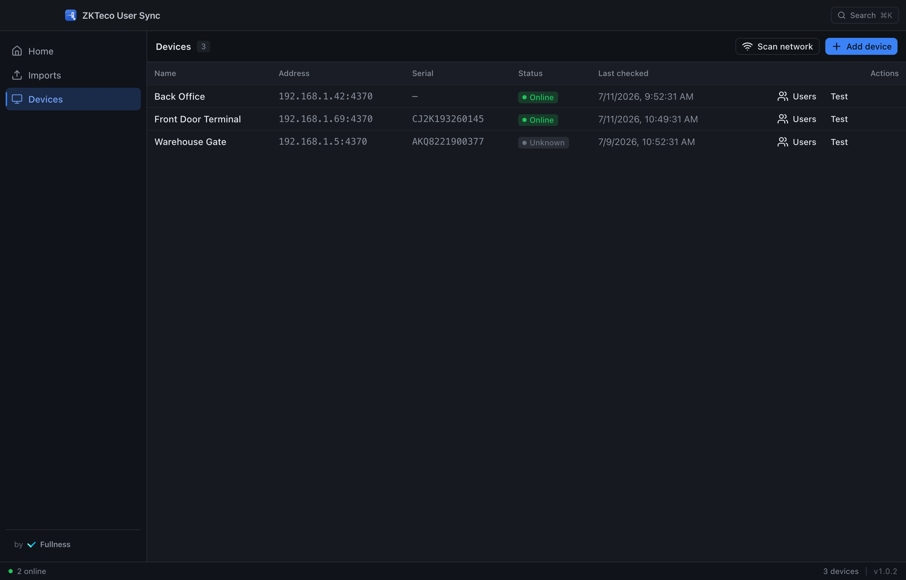
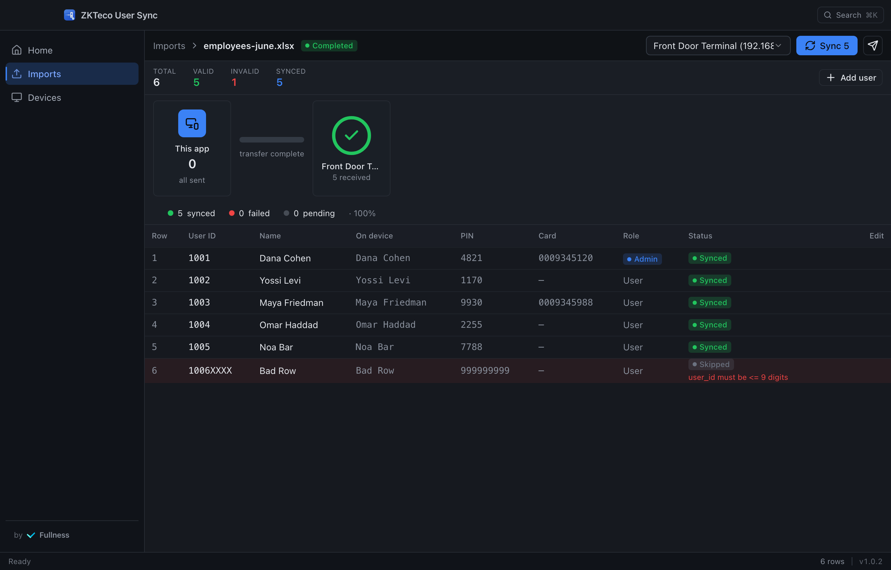

<div align="center">
  

  <h1>ZKTeco User Sync</h1>

  <p><b>Bulk-provision your ZKTeco attendance &amp; access terminals from an Excel file.</b></p>

  <p>Upload a spreadsheet of employees, review and edit the rows, then push every user — with their
  PIN, card and privilege — straight onto the terminal over your local network. No cloud; everything
  stays on your machine.</p>

  <p><b><a href="https://github.com/yousefkadah/zkteco-user-sync/releases/latest">⬇&nbsp; Download for macOS · Windows · Linux</a></b></p>

  <sub>A <b>Fullness</b> product · <a href="https://fullness.co.il">fullness.co.il</a></sub>
</div>

---

## Screenshots

|  |  |
| :---: | :---: |
| **Home** | **Imports** |
|  |  |
| **Devices** | **Review &amp; sync** |
|  |  |

---

## Download &amp; install

Grab the latest installer for your OS from the **[Releases page](https://github.com/yousefkadah/zkteco-user-sync/releases/latest)**:

| macOS | Windows | Linux |
| :---: | :---: | :---: |
| `.dmg` (Apple Silicon) | `.exe` installer | `.AppImage` or `.deb` |

The app **updates itself** — it checks GitHub for a newer release on launch and installs it (Windows &amp; Linux; macOS updates by re-downloading).

> **First launch — the app isn't code-signed yet.** Because there's no paid signing certificate,
> your OS/browser shows a one-time "unverified"/"unknown publisher" warning. It is safe:
> - **macOS:** System Settings → Privacy &amp; Security → **Open Anyway**.
> - **Windows (SmartScreen):** **More info → Run anyway**.
> - **Chrome download flagged as dangerous:** open the downloads bar → the file's **⋮** menu → **Keep**.

---

Built with [NativePHP for Desktop](https://nativephp.com) (Laravel + React/Inertia
+ [shadcn/ui](https://ui.shadcn.com) wrapped in Electron), so it ships as a native
desktop app while staying a normal Laravel codebase underneath.

---

## What it does

1. **Devices** – **scan the local network to auto-discover terminals** (a
   non-blocking UDP sweep of your subnet on port 4370), or add one manually
   (name, IP, port `4370`, optional communication key). "Test connection" reads
   the serial, firmware and current user count. Open a device to **view, add,
   edit or remove the users stored on the terminal** directly — no import needed.
2. **Import** – drop in an `.xlsx`, `.xls` or `.csv`. Every row is validated
   against the device's field limits before anything is written.
3. **Sync** – push the valid rows to the selected device with a live progress
   bar and per‑row success / failure results.

### How the sync works

* Talks the native ZKTeco **UDP protocol on port 4370** via
  [`coding-libs/zkteco-php`](https://github.com/coding-libs/zkteco-php)
  (supports the device *communication key* for locked terminals).
* Reads the existing users first, so a sync is **idempotent by `user_id`** — an
  existing person is updated in place instead of being duplicated, and free
  device slots (`uid`) are allocated without clobbering anyone.
* The terminal is **disabled during the write and re-enabled after**, so a punch
  mid-sync can't corrupt the batch.
* Runs in a background queue job with a progress bar, so large lists don't block
  the window.

---

## Excel template

Download a ready-made template from the app (**Imports → Download template**), or
build one with these columns (header names are matched loosely, English or
Hebrew):

| Column        | Required | Rules                                             |
| ------------- | -------- | ------------------------------------------------- |
| `user_id`     | yes      | digits only, **≤ 9 digits**, unique in the file   |
| `name`        | yes      | transliterated to ASCII and capped at **24 chars**|
| `password`    | no       | the device PIN — digits only, **≤ 8 digits**      |
| `card_number` | no       | digits only, ≤ 10 digits                          |
| `privilege`   | no       | `user` (default) or `admin`                       |

> **Tip:** format the `password` and `user_id` columns as **Text** in Excel so
> leading zeros (e.g. a PIN of `0042`) aren't dropped.

Non‑ASCII names (Hebrew/Arabic) are automatically transliterated because the
device stores names in a 24‑byte ASCII field.

---

## Development

Requirements: PHP 8.4+ (developed on 8.5), Composer, Node 20+.

```bash
composer install
npm install
cp .env.example .env
php artisan key:generate
touch database/database.sqlite
php artisan migrate
npm run build
```

Run it as a desktop window (Electron + Vite dev server + queue worker):

```bash
composer native:dev
```

Or run it in a browser during development:

```bash
php artisan serve          # http://127.0.0.1:8000
npm run dev                # Vite
php artisan queue:work     # processes the sync jobs
```

## Building & publishing (macOS · Windows · Linux)

```bash
php artisan native:build mac      # → .dmg (+ .zip)
php artisan native:build win      # → NSIS setup .exe
php artisan native:build linux    # → .AppImage and .deb
```

NativePHP bundles a static PHP binary from
[`NativePHP/php-bin`](https://github.com/NativePHP/php-bin) (8.3 / 8.4 / 8.5 for
`win-x64`, `mac-*` and `linux-*`). Build each platform on that platform.

For code signing / notarization and for **app-store** submission (Microsoft Store
via MSIX is feasible; the Mac App Store is possible but heavy), see
**[PUBLISHING.md](PUBLISHING.md)**.

## Tests

```bash
php artisan test
```

The ZKTeco device I/O is covered by a fake terminal
(`tests/Doubles/FakeZkteco.php`), so the sync pipeline is fully tested without
any hardware.

---

## Notes & scope

* This is a LAN tool — the machine running it must be able to reach the device's
  IP on UDP `4370`.
* Device **PINs are stored in the app's local SQLite database in plain text**
  (they have to be sent to the terminal verbatim). It's a single‑user desktop
  tool; keep the machine trusted.
* Fingerprint / face templates are **not** part of this tool — it provisions
  user records + PIN + card + privilege only.

## Tech stack

Laravel 13 · React 19 + Inertia · **shadcn/ui** (Radix + Tailwind CSS 4) ·
TypeScript · NativePHP for Desktop 2 (Electron) · `coding-libs/zkteco-php` ·
`phpoffice/phpspreadsheet` · SQLite.
